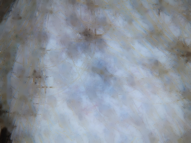
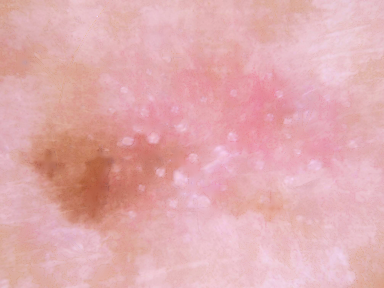
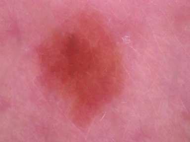
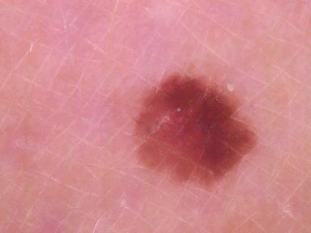

# Projects in Data Science (2025)

In this mini project Group O was set to multiple tasks to do. Firstly we had to annotate 100 pictures(1834-1934) based on how hairy they are on a scale of 0-1-2,
and then we had to take the given code from our lectures about how to process these images, to remove the hair and possibly outline the pictured leisions.
At a first glance at the data set we notice that there are many different problems that could make our task harder, like: 
 
-Blurry pictures(ex 1837 & 2001) 
-Huge overlap between hair and leision(ex 1846) 
-Pen marks(circling the leision, ex 1847 &2001) 
-Foreign spots on the picture(ex 2002) 
 
### Results of hair removal code 
We found that our code were able to remove hair really well, but there is cases where more than the hair is removed.  
On the pictures below, we are looking at two senarios where our code removed too much information, leaving the picture with less a than ideal amount of detail. 

 
 
Below here are some examples of great work done by our code, leaving a good amount of detail. 

 
 

### Improvement Ideas
#### 1. Dynamic Kernel Size Based on Hair Intensity
   - **Problem**: Currently, the kernel size for hair removal is fixed at 25. However, images with more/dense hair might benefit from a larger kernel, while images with sparse or fine hair may require a smaller kernel to avoid over-processing.
   - **Solution idea**: Adjust the kernel size dynamically based on the histogram of the grayscale image. If the intensity histogram shows a peak (indicating darker areas where hair is present), use a larger kernel and a smaller kernel otherwise.

#### 2. Brush Radius Adjustment for Inpainting
   - **Problem**: The current inpainting process uses a fixed radius for painting over removed areas, which might not be ideal as large regions may lead to unnatural inpainting, while small regions might result in incomplete hair removal.
   - **Solution idea**: Introduce an adaptive brush radius based on the image characteristics.

#### 3. Edge Detection to Preserve Important Details
   - **Problem**: In some cases, the hair removal process might erase important edges of lesions or skin features, leaving an unnatural result.
   - **Solution idea**: Integrate an edge detection method to preserve the structural integrity of the lesions while removing hair. This could be combined with the hair removal process to minimize the loss of important details.

#### 4. Post-Processing to Refine Results
   - **Problem**: After hair removal, the image might have some residual artifacts or remain somewhat blurry due to the inpainting process.
   - **Solution idea**: Apply a post-processing step to refine the results. This could involve sharpening the image or applying filters to restore some lost details after inpainting.