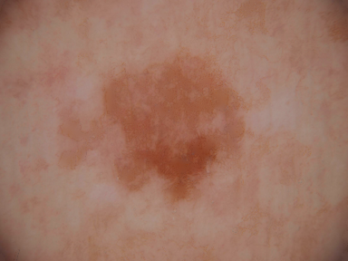
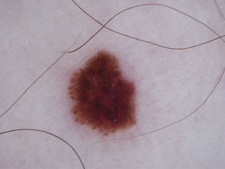

# Projects in Data Science (2025)

In this mini project Group O was set to multiple tasks to do. Firstly we had to annotate 100 pictures(1834-1934) based on how hairy they are on a scale of 0-1-2,
and then we had to take the given code from our lectures about how to process these images, to remove the hair and possibly outline the pictured leisions.
At a first glance at the data set we notice that there are many different problems that could make our task harder, like: 
 
-Blurry pictures(ex 1837 & 2001) 
-Huge overlap between hair and leision(ex 1846) 
-Pen marks(circling the leision, ex 1847 &2001) 
-Foreign spots on the picture(ex 2002) 
 

### Code for Hair Removal 
Our code in `main.py` first reads the CSV file and filters the images that belong to our group. Once selected, `ImageDataLoader` loads them and extracts both an RGB and grayscale version of each image. 

Using a `for` loop, we iterate through the images and apply hair removal using the `removeHair()` function. This function returns:

1. **Blackhat Image** : The result of the blackhat morphological operation, highlighting dark objects against the background.
2. **Thresholded Mask** : A binary mask used for inpainting. White areas indicate non-black regions before thresholding.
3. **Inpainted Image** : The final image with hair removed using inpainting.

For better visualization, we plot these four images in a single figure with labeled titles:  
**Original Image, BlackHat Image, Thresholded Mask, Inpainted Image**.  

Finally, we save the processed images to the `results/` folder. Below is an example of the hair removal process: 
 

 

### Results of hair removal code 
Our code was able to successfully remove hair from most pictures, though the way the code works lets it remove more than just hair strands. 
On the pictures below, we are looking at two scenarios where our code removed information leaving the picture with less than an ideal amount of detail. 
The original being on the left and the inpainted being on the right. Putting them side to side we can see that there are two scenarios where our code has difficulty.  
Firstly, when a picture has too much hair on it, the removal of the hair without any knowledge of what was behind all of the hair, leaves little detail. 
The other set of pictures has the opposite problem, when there is no hair to remove, the code removes color differences in the mole. 
This could potentially be important information in determining cancer. 

  
  
Below here are some examples of great work done by our code, leaving a good amount of detail. 
We see a pattern of high contrast hair versus skin makes it easier to remove the hairs, and darker, more dense moles on light colored skin is also less subsebtible to become overly corrected by the code.

  
  

### Improvement Ideas
#### 1. Dynamic Kernel Size Based on Hair Intensity
   - **Problem**: Currently, the kernel size for hair removal is fixed at 25. However, images with more/dense hair might benefit from a larger kernel, while images with sparse or fine hair may require a smaller kernel to avoid over-processing.
   - **Solution idea**: Adjust the kernel size dynamically based on the histogram of the grayscale image. If the intensity histogram shows a peak (indicating darker areas where hair is present), use a larger kernel and a smaller kernel otherwise.

#### 2. Brush Radius Adjustment for Inpainting
   - **Problem**: The current inpainting process uses a fixed radius for painting over removed areas, which might not be ideal as large regions may lead to unnatural inpainting, while small regions might result in incomplete hair removal.
   - **Solution idea**: Introduce an adaptive brush radius based on the image characteristics.

#### 3. Edge Detection to Preserve Important Details
   - **Problem**: In some cases, the hair removal process might erase important edges of lesions or skin features, leaving an unnatural result.
   - **Solution idea**: Integrate an edge detection method to preserve the structural integrity of the lesions while removing hair. This could be combined with the hair removal process to minimize the loss of important details.

#### 4. Post-Processing to Refine Results
   - **Problem**: After hair removal, the image might have some residual artifacts or remain somewhat blurry due to the inpainting process.
   - **Solution idea**: Apply a post-processing step to refine the results. This could involve sharpening the image or applying filters to restore some lost details after inpainting.

### Final Outcome in Theory
Although we did not implement the suggested improvements, we can infer how the final images might have looked had we refined our approach. 
The current method effectively removes hair but sometimes loses crucial details. If the adaptive methods were in place, we would expect:

   - **Better Preservation of Lesion Details**: The edge detection approach would have helped retain mole boundaries, making the images more useful for medical analysis.  
   - **More Accurate Hair Removal**: The dynamic kernel adjustment would have prevented over-removal in less hairy regions and enhanced results in densely covered images.  
   - **Cleaner, More Natural Inpainting**: By refining the inpainting process with an adaptive brush radius, the final images would likely have fewer artifacts and a more realistic appearance. 
While the current output is already functional, implementing these improvements could have led to more reliable and higher-quality images for further analysis.